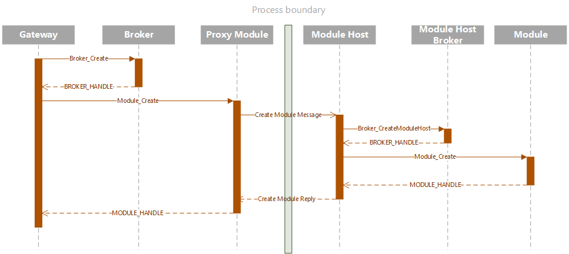
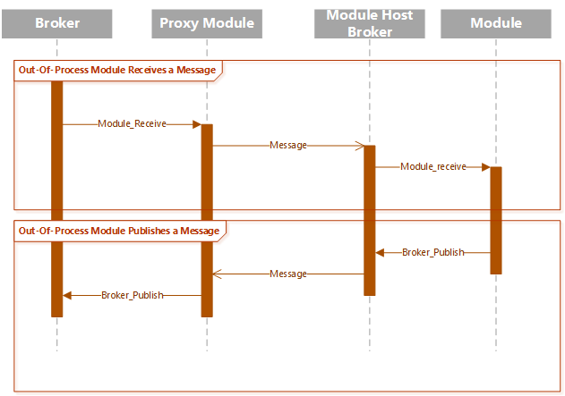
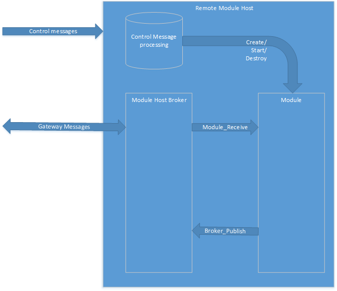

Azure IoT Gateway Remote Modules
================================

Introduction
------------

All modules in the gateway are hosted within the gateway process today. While this makes for great performance it is also at the cost of execution isolation between modules, i.e., one misbehaving module can potentially affect the behavior of other modules or the gateway itself. This document specifies how to host gateway modules outside the gateway process.

The remote module is applicable for a customer that has device telemetry and control in another process, and wants to send that telemetry data to the gateway with a minimum of new code.

Design Goals
------------

One design goal is the notion that developers who are implementing modules should be able to take a working module as is and host the module in a process outside the gateway process. All the complexities of activation and inter-process communication should be transparently handled by the gateway framework.

Another design goal is to enable the implementation of module host processes in popular programming languages and technology stacks. This is will be achieved by specifying the serialized gateway and control messages and fulfilling the interface of a module host implementation.

Design Non-goals
----------------

It is possible that a remote module, due to implementation issues (a.k.a. bugs), becomes unstable and precipitates a process hang or termination. The scope of this document does not cover these recovery scenarios. It is assumed that mechanisms external to the gateway will be used for this purpose at this time.

Design Overview
---------------


The Gateway will still consist of the gateway, broker and modules, seen above as the "Gateway Process." To implement the out of process modules, the gateway process will now spawn a proxy module, which will forward control and data to a module host process (or proxy gateway).

As an example of control flow from the Gateway to the Module host, this is an elided sequence diagram for outprocess module creation:



> *NOTE: The call to the remote module will be a synchronous call.*

Message passing from the gateway to a remote module will look like this:




### Inter-process Communication

Inter-process communication between the gateway process and the process hosting the module will be managed using **nanomsg** [Pair](http://nanomsg.org/v1.0.0/nn_pair.7.html) sockets for control, and **nanomsg** [Pair](http://nanomsg.org/v1.0.0/nn_pair.7.html) sockets for messaging. The gateway will create two `NN_PAIR` sockets for each remote process. The module host (or proxy gateway) will create the corresponding two `NN_PAIR` sockets. The module host is a service to the gateway, but gateway content (messages) is sent as peers. The control channel identifier must be given to the module host process, and the remaining configuration for the outprocess module is provided through the control channel.

The [Gateway Block Diagram](../../../core/devdoc/media/Gateway_block.vsdx) outlines the module control functions the gateway performs and the message receive and publish functions the broker performs.

The following diagram shows which entities will handle the control channel, which is analogous to the gateway block diagram. 

> *See also: [Proxy/Module Host Control Communication Protocol](#control_communication)*  
> *See also: [the control channel communication section](control_communication)*  
>
> *NOTE: For the purposes of this document we will only describe connecting to modules using the ipc transport provided in **nanomsg**. This will be the default transport for outprocess modules when a URI is not given. **nanomsg** supports TCP, but it is currently not secured and therefore not recommended until a secure transport is available.*

Remote Module Composition
-------------------------

### Proxy Module


The first piece of the puzzle is a gateway module (i.e., it implements `MODULE_API`) we shall call the *proxy* module. The job of the proxy module is to ensure the remote module is appears to be no different than an module running in the Gateway process. In order to communicate with the remote module host, the proxy module will create a *nanomsg* `NN_PAIR` socket and listen for gateway messages on it. It will also create an `NN_PAIR` socket and connect to the control channel.

This is a brief description of the repsonsibilies of the proxy module.

- **Module_ParseConfigurationFromJson** - The proxy module will serialize the arguments into a JSON string.

- **Module_FreeConfiguration** - The proxy module will free the serialized string.

- **Module_Create** - The proxy Module will format a *Create Module* request and send it via the control channel to the outprocess module, it will wait for a response before returning.

- **Module_Destroy** - The proxy Module will format a *Destroy Module* message and send it via the control channel to the outprocess module. It will not wait for a response.

- **Module_Receive** - The proxy module will serialize the message and send it via the message channel to the outprocess module.

- **Module_Start** - The proxy module will format a *Start Module* message and send it via the control channel to the outprocess module.

- The proxy module will also create a task to read any gateway messages published from the remote module.


### Outprocess Module Loader

The proxy module will be loaded by the "outprocess" module loader type. This will be responsible for providing the proxy module API to the gateway.

There is no configuration for the proxy module loader.

The proxy module connection information is placed in the "entrypoint" for the loader.

If the activation type is "launch", then a launch object must be added as a sister element to "activation.type" (example below).

An example of the "loaders" entry:

```JSON
"loaders" : [
    {
        "name" : "myRemoteModuleLoader",
        "type" : "outprocess"
    }
]
```

An example of proxy module configuration with activation.type "none" :

```JSON
"modules" : [
{
    "name" : "myRemoteModule",
    "loader" : {
        "name" : "myRemoteModuleLoader",
        "type" : "outprocess",
        "entrypoint" : {
            "activation.type" : "none",
            "control.id" : "outprocess_module_control"
        }
    }
    "args" : {...}
}
]
```

An example of proxy module configuration with activation.type "launch" :

```JSON
"modules" : [
{
    "name" : "myRemoteModule",
    "loader" : {
        "name" : "myRemoteModuleLoader",
        "type" : "outprocess",
        "entrypoint" : {
            "activation.type" : "launch",
            "control.id" : "outprocess_module_control",
            "launch" : {
                "path" : "/path/to/remote/module.exe",
                "args" : [
                    "<available to remote module as argv[1]>",
                    "<available to remote module as argv[2]>",
                    "..." ,
                    "<available to remote module as argv[n]>"
                ],
                "grace.period.ms" : 2250
            }
        }
    }
    "args" : {...}
}
]
```

#### Proxy Module Configuration

The proxy module’s configuration will include the following information:

- **name**

  The user defined identifier for the remote module

- **loader**

  The information detailed here will be specific to the `outprocess` loader type. General loader information may be found [here](../../../core/devdoc/module_loaders.md).

  - **name**

    A user defined identifier for the loader

  - **type**

    This must be set to `outproces` for remote modules.

  - **control.id**

    The proxy module will use a control channel to send control information to the module host process; this is a required argument. The identifier is any string that uniquely identifies the control channel. Duplicate strings will cause the module creation to fail.

  - **message.id**

    The proxy module will send and receive gateway messages on sockets attached to this ID; this is an optional argument. The identifier must be a unique string that identifies the message channel. Duplicate strings will cause the module creation to fail. 

    > *NOTE: If the Message Channel ID is not set, the message channel URI will be generated on your behalf.*

  - **activation.type**

    This is an enumeration with values indicating how the hosting process will be activated. It could indicate one of the following possible values:

    - **none** - An activation type of **none** indicates that the proxy module does not need to do anything to *activate* the module. The expectation is that out-of-band measures will be adopted to ensure that the remote module will be activated.

    - **launch** - An activation type of **launch** means that the proxy module will attempt to launch the hosting process when the module is initialized. An additional launch object (*example shown above*) is required to properly launch the remote module.

  - **launch**

    The configuration parameters required for launching an executable.

    - **path**

      A path to the executable that will host the remote module

    - **args**

      An array of command line arguments, if any.

    - **grace.period.ms**

      An optional grace period (in milliseconds) to be observed before killing the process after the `Module_Destroy` message has been sent. If no time is specified, the default value will be 3000 milliseconds.

- **args**

    This the module configuration JSON to be passed to the `Module_ParseConfigurationFromJson` function of the `MODULE_API`. This information will be transmitted to the remote module host via the control channel.

### Remote Module Host (a.k.a. Proxy Gateway)

The proxy module’s remote counterpart is a remote module host (*known to the remote module as a proxy gateway*). The remote module host implements the communication protocol for control messages and is responsible for running the remote module and brokering communication between that module and the gateway.

The remote module host does the following:

1. Create and open a control channel as a pair connection.

2. Listen for a *Create Module* message.

3. When a *Create Module* message arrives,

   1. Read the args from the *Create Module* message.

   2. Create the module using the args from the *Create Module* message.

   3. Send a response with success or failure.

4. Listen for a *Module Start* message.

5. When a *Module Start* message arrives, then call `Module_Start`, if defined.

6. Listen for a *Module Destroy* message.

7. If a *Module Destroy* message arrives, the call `Module_Destroy` on the module.

> *NOTE: If the module's loader activation type was configured as `launch`, then the remote module host will have `grace.period.ms` milliseconds to complete its execution upon receiving the *Module Destroy* message, before it will be killed.


#### Message Brokering

Any messages received on the message channel are forwarded directly to the remote module. However, when a remote module wishes to publish a message, it requires a `BROKER_HANDLE`. Modules received broker handles during the call to `Module_Create`. As such, a psuedo-"broker handle" is provided by the remote module host, and is used to determine which proxy module (*running in the Gateway process*) shall receive the messages.

### Native Module Host

In order to support loading native modules as a shared library (the first design goal), the module host will require both loader arguments and module arguments.

The "args" for a Native Host Module will look like the following:
```JSON
"args" : {
    "outprocess.loader" : {
        "name": "native",
        "entrypoint": {
        "module.path": "..\\..\\..\\modules\\azure_functions\\Debug\\azure_functions.dll"
    },
    "module.arguments" : {
        "hostname": "<YourHostNameHere from Functions Portal>",
        "relativePath": "api/<YourFunctionName>",
        "key": "<your Api Key Here>"
    }
}
```

An outprocess module declared in the gateway will look like:

```JSON
"modules" : [
{ 
    "name" : "outprocess_azure_function",
    "loader" : {
        "name" : "outprocess"
        "entrypoint" : {
            "activation.type" : "none",
            "control.id" : "outprocess_azure_module_control",
            }
        }
    }
    "args" : {
        "outprocess.loader" : {
            "name": "native",
            "entrypoint": {
            "module.path": "..\\..\\..\\modules\\azure_functions\\Debug\\azure_functions.dll"
        },
        "module.arguments" : {
            "hostname": "<YourHostNameHere from Functions Portal>",
            "relativePath": "api/<YourFunctionName>",
            "key": "<your Api Key Here>"
        }
    }
}
]
```

Proxy/Module Host Control Communication Protocol
------------------------------------------------

<a name="control_communication" ></a>
The proxy and the module host communicate via *messages* using *nanomsg*
pair sockets. The different message types and how they work has been
described below. The ordering of the message types given below corresponds
roughly with the sequence in which these messages are sent and received. Each
message packet is structured like so:


-   **Create Module Request**

    This message is sent by the proxy to the module host after it establishes a
    socket connection. The data content will be as follows:
    ```c
    struct 
        {
        const uint32_t uri_type;
        const uint32_t uri_size;
        const uint8_t  message_channel_uri[uri_size];
    } MESSAGE_URI;

    const uint8_t gateway_message_version;
    MESSAGE_URI  uri;
    const uint32_t args_size;
    const char     args[arg_size];
    ```

    where
    >| Field                   | Description   |
    >|-------------------------|---------------|
    >| gateway_message_version | The version of gateway messages being sent |
    >| uri_type                | Implementation specific URI type. (e.g NN_PAIR) |
    >| message_channel_uri     | The message channel URI, for the socket which the proxy and outprocess module exchange gateway messages. |
    >| uri_size                | Size of the messaging URI. |
    >| args                    | Serialized JSON string of module arguments. |
    >| args_size               | Size of the module arguments. |


-   **Module Reply**

    This message is sent by the module host in response to a *Create Module*
    request from the proxy. The *data* in the packet is a boolean status
    indicating whether the module creation was successful or not.

-   **Start Module Request**

    This message is sent by the proxy to the module host when `Module_Start` is called on the proxy module. 

-   **Heartbeat Request**

    Reserved for future use, this message will be sent by the proxy to the 
    module host when it wants to confirm the module host is still running.

-   **Heartbeat Reply**

    Reserved for future use, this message will be sent by the module host to 
    the proxy in repsonse to the heartbeat request. 

-   **Destroy Module Request**

    This message is sent by the proxy to the module host when the module is
    being shut down. There is no *data* associated with this message and no
    reply is expected to be sent by the module host. The module host is expected
    to invoke `Module_Destroy` on the module and quit the process.


Alternate Approach - Reusing Broker’s Nanomsg Socket
----------------------------------------------------

The topic based routing implementation of the message broker today uses a
*nanomsg* socket for supporting publish/subscribe communication semantics. Given
that there is already a *nanomsg* socket, the idea is to explore whether we can
simply tack-on a TCP (or IPC) transport endpoint to it and communicate directly
with it from the module host. While this approach works it does not appear to
obviate the need for:

1.  Having a *proxy* module that represents the module being hosted in the
    external process because we’d still need a way of *activating* the outprocess
    module which, with a proxy module, we could implement from the
    `Module_Create` API.

2.  Establishing a separate *control* channel between the proxy module and the
    module host process since the proxy will still need to communicate the
    following information to the module host:

    1.  The *nanomsg* endpoint URI at which the broker is listening for messages

    2.  The topic name to use for publishing messages to the broker

    3.  The topic names that the out of process module should subscribe to

    If the activation type chosen is *fork*, then we might conceivably pass this
    information via the command line. If other activation types were chosen
    however then we would need to have a control channel to pass this
    configuration data. Also, even when the activation type is *fork*, when the
    Gateway SDK gains the ability to dynamically add new modules, new
    subscriptions that may now be in effect will need to be passed to the out of process module which, again, requires that there be a control channel 
    which can be used for this purpose.

This approach also requires that the broker use topic names for each module read
from configuration instead of using pointer values as it currently does. This is
needed so that the module host knows what topic to publish to when the module
calls `Broker_Publish`.

With this approach we discover that the module host ends up having to
re-implement a non-trivial portion of the broker in it’s *proxy broker*
implementation. It will for instance, need to re-implement the message loop that
reads from the *nanomsg* subscribe socket, strip out the topic name from the
message and deserialize and deliver the message to the module. Similarly, when
the module calls `Broker_Publish` the proxy broker will need to serialize the
message into a byte array and prefix it with the correct topic name. All of this
is functionality that the broker in the gateway already implements.

The take away appears to be that while this can be made to work, having a
separate proxy module and control channel seems to lend itself to a cleaner,
more natural implementation.
